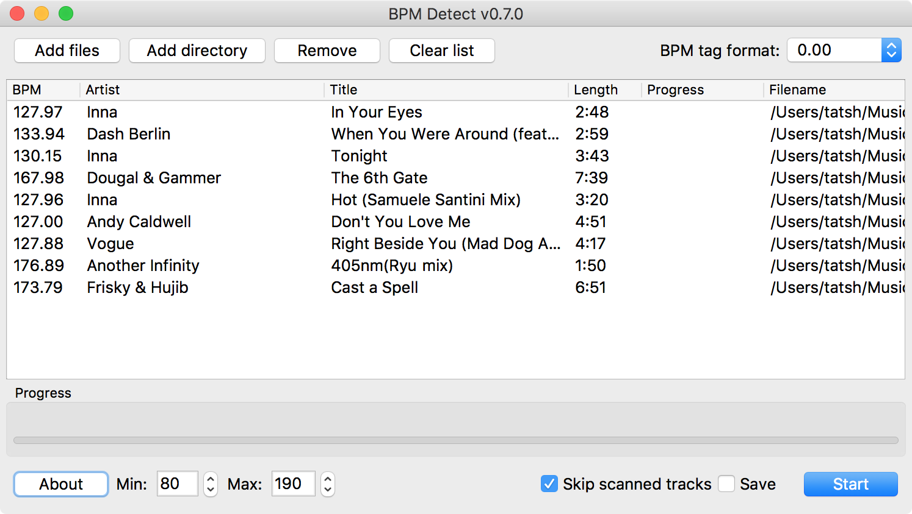

# BPM Detect

BPM Detect is an automatic BPM (beats per minute) detection utility.

This version has been modified to use the Qt Multimedia framework for BPM testing. This feature is
only available on Windows and Linux at this time.

It uses SoundTouch's BPM library for detecting BPMs, TagLib for reading and writing BPMs to tags
and Qt 6 for the GUI. Aditional libraries (mad, vorbisfile, FLAC) are used for decoding and the
Qt Multimedia framework is also used for audio output (testing BPMs).

All file-loading libraries (flac, libmad, etc) are optional.

[Original project](https://sourceforge.net/projects/bpmdetect/)
